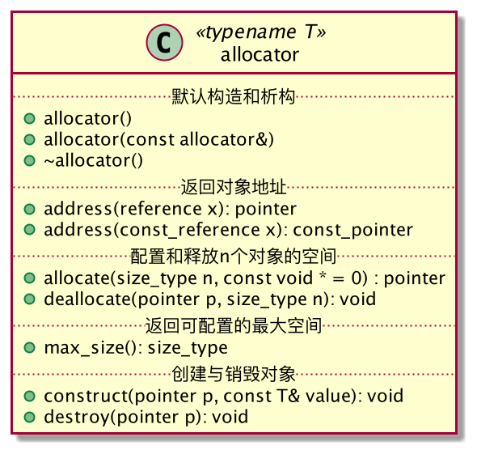

# SGI STL源码剖析

### 1、空间分配器（Allocator）

### 2、容器（Container）

### 3、算法（Algorithm）

### 4、迭代器（Iterator）

### 5、仿函数（Functor）

### 6、适配器（Adaptor）

## TODO List

空间适配器 
- 实现`ZhuAllocator`【Done】

- 梳理空间分配器标准接口

- 分析具有次级配置的SGI空间分配器
  
- 分析基于malloc的空间分配器